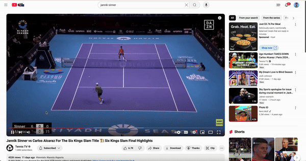
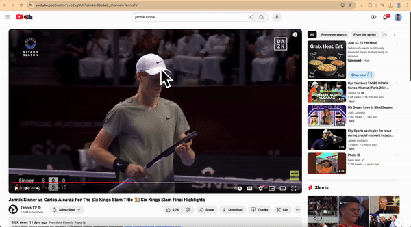
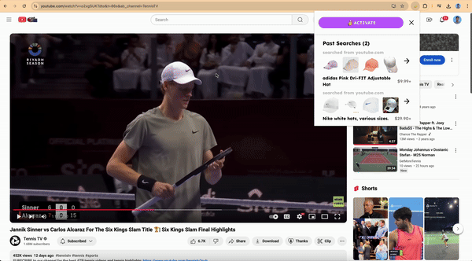

# SeeClickBuy

**This project was awarded third place at the [Sushi Hackathon 2024](https://sushihackathon.com). Here's the [deck](https://docsend.com/view/vp8tgjwfptiattyn) we pitched to the judges.** 

*Trouble finding the perfect item? HATE ADS!?* Buying stuff online shouldn't be so hard.

SeeClickBuy is a chrome extension to buy anything you see on the internet. It allows you to click on images, videos, and more and find the best deal for them. If you want to change the color of the item, or tweak the style, you can chat with an AI bot to generate modified search results. 

|  |  |  |
|----------------------------------------|----------------------------------------|----------------------------------------|

Built on top of Meta's Segment-Anything-2 model, Google Lens, and the OpenAI API.

## Setup

These instructions are for a linux machine with a GPU e.g. a lambda or runpod machine. You may need to customize this setup for your own machine. 

### Download models

Download model checkpoint [sam2.1_hiera_large.pt](https://dl.fbaipublicfiles.com/segment_anything_2/092824/sam2.1_hiera_large.pt) and put it in the `ai/checkpoints/` folder.

### Firebase 

You will need a Firebase project, which saves all the clicks and chats users make with the extension. You can create a free Firebase project [here](https://firebase.google.com/) in the console. 

Once you have a project, create a service account in the console and download the `service_account.json` file. Place it in `server/server/seeclickbuy.json` (see line 5 of `database.py`). 

### Frontend Installation

(I am using `node v19.7.0` through `nvm`.) We use a chrome extension boilerplate in `odin/`. Most of the files will not be relevant to this project. We recomment paying attention to `pages/popup`, `pages/content-runtime`, and `packages/shared/lib/hooks`.

From inside the `odin/` directory, run 
```bash
npm install pnpm
```
Then run 
```bash
pnpm install
```
which should create a `node_modules` folder among other things.  

It is also worth noting line 1 of `shared/lib/hooks/api.ts` which sets the base URL for the web server.
```
const BASE_URL = "http://localhost:8000";
```
You will need to change this is you deploy your web server to a remote server e.g. `ngrok`.

### Backend Installation

Run the following to install redis, ngrok, git, and other basic essentials.
```bash
bash setup.sh
```
Run the following to install a conda environment with PyTorch, and also clone the segment-anything-2 repo. This requires a GPU. 
```bash
bash install.sh
```
This command will already install requirements for the `ai/` and `server/` folders.

### Environment Variables

See `server/server/env.template`. Create a file in the same directory called `.env`. You will need a [SERP API key](https://serpapi.com) for google lens queries and an [OpenAI API key](https://platform.openai.com/api-keys) for LLM calls. Add those to `.env` file:
```bash
BROKER_URL=redis://localhost:6379/0
CELERY_BROKER_URL=redis://localhost:6379/0
CELERY_RESULT_BACKEND=redis://localhost:6379/0
SERP_API_KEY=...
OPENAI_API_KEY=...
```

## Usage

There are a three components: the chrome extension, the web server, and the worker server. 

### Web server

To start the web server, run 
```bash
bash start_server.sh
```
from the `server/` directory. 

This will load a FastAPI server at `localhost:8000`. See `http://localhost:8000/docs` for the API docs. 
Once you can run this, you can rest assured that you have all the dependencies set up correctly. 

### Worker server

To run inference for user requests, we use a Celery server with workers that can asynchronously pick up tasks from a Redis queue. 

To start the worker server, run 
```bash
bash start_celery.sh
```
from the `server/` directory. By default, we just run one worker. You may change this by editing the `--concurrency` flag. 

### Chrome extension

To start the chrome extension in development mode, run
```bash
pnpm dev
```
from the `odin/` directory. This will create a `dist/` folder with a build of the extension. 

To load the extension in chrome, go to `chrome://extensions/`, enable "Developer mode", click "Load unpacked", and select the `dist/` folder. There are many walkthroughs online for this part of the process. 

If you want to build the extension for production, run 
```bash
pnpm build
```
from the `odin/` directory. This will create a `build/` folder with a build of the extension. 
